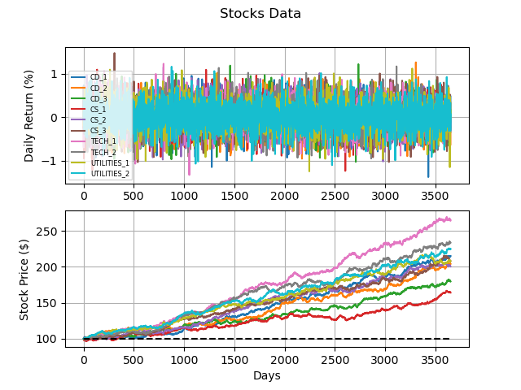
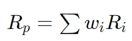
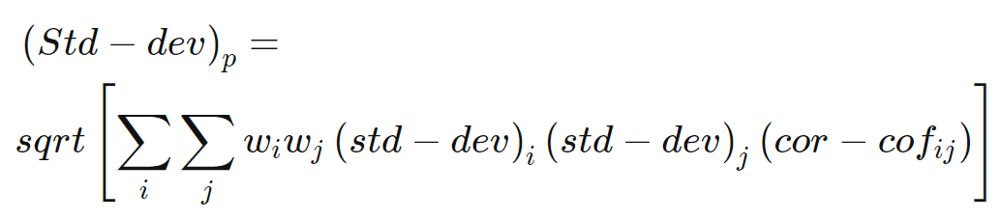

# Portfolio Management

Steps:

1. Generate Data ✅
2. Descriptive Analysis ✅
3. Allocation and Rebalance of Portfolio ✅

# Question 1

* First approach: fixed volatility for each stock in the portfolio.

* Second approach: GBM (Geometric Brownian Motion)

The Geometric Brownian Motion is a specific model for the stock market where the returns are not correlated and distributed normally.

GBM still considers fixed volatility.

Brownian model of financial markets requires an assumption of perfectly divisible assets and a frictionless market (i.e. that no transaction costs occur either for buying or selling).

* Third approach: GBM + Correlation Market-Stocks

The overall market growth was considered (7% per year), so: 1.07 = (1+i)^(365) => i≈0.0001854 (0.01845% per day)

* Fourth approach: GBM + Correlation Market-Stocks + Random volatility

An approximation of the Heston model: volatility of the asset follows a random process

* Fifth approach: GBM + Correlation Market-Stocks + Random volatility + Correlation Stock-Stock

To finish the generation of simulated data, I included a simple heuristic of correlation between stocks of the same market sector.

* Simulation:

# Question 2

A good set of stocks is based in the diversity of markets.

We have a total of 11 market sectors and 24 industries groups. I considered only the market sectors for simplification of the problem.

Based in performance and volatility for-sectors in the 2010s, I considered investing in:

* Consumer Discretionary (CD) and Technology (TECH) because of the high returns.

* Consumer Staples (CS) and Utilities bacause of the low strandard deviations (+ not negative returns).

Source: https://www.spglobal.com/en/research-insights/articles/performance-and-volatility-for-sectors-in-the-2010s

By MPT (Modern Portfolio Theory), we can calculate the overall portfolio return R_p as:

where w_i is the proportionate weight of asset i in the portfolio, R_i is the return (mean) of asset i.

and the overall portfolio risk (Std-dev)_p as:

where cor-cof is the correlation coefficient between returns of assets i and j.

Applying the above formula to our simulated data, we have (equal weights between all stocks):

* Overall Market Return: 0.02044 %

* Market Standard Deviation: 9.9909 %

# Question 3

* First month composition of my portfolio:

CD_1: 0.097602

CD_2: 0.137589

CD_3: 0.044159

CS_1: 0.115306

CS_2: 0.136988

CS_3: 0.110550

TECH_1: 0.063866

TECH_2: 0.124480

UTILITIES_1: 0.117612

UTILITIES_2: 0.051847

* Trades for Second month:

CD_1: 66.934120 %

CD_2: -21.272943 %

CD_3: 50.232776 %

CS_1: 48.073879 %

CS_2: -89.285378 %

CS_3: 39.828943 %

TECH_1: 143.404125 %

TECH_2: -44.884761 %

UTILITIES_1: -30.774548 %

UTILITIES_2: -71.664230 %

* Trades for Third month

CD_1: -39.286860 %

CD_2: -95.694088 %

CD_3: 155.718475 %

CS_1: -79.209583 %

CS_2: 819.364055 %

CS_3: 5.951559 %

TECH_1: -35.694130 %

TECH_2: 135.121817 %

UTILITIES_1: 8.850151 %

UTILITIES_2: 179.592657 %

* Portfolio Performance

** Return: 1.325144 %

** Monthly Volatility: 0.005010

** Sharpe Ratio: 2.645185

# Future Works

* Refactorize the code in more than only one .py file (main.py, generate_data.py, utils.py, ...)

* Plot  efficient frontier graph (expected return x risk)

* Consider national economy influence (Food and Staples Retailing Market has a high correlation with inflation)

## Other Works

* Aplicate IL (Imitation Learning) to try to simulate Stock Market

* "Econometricians have come up with plenty of models for stock prices. The one that seems to work in a lot of situations is an autoregressive model for the conditional mean combined with an (G)Arch type model for the volatility. For the volatility model, an assymetric GARCH with a fat-tail distribution (like Student's t) seems to work the best for a variety of financial markets."

** Source: https://stackoverflow.com/questions/8597731/are-there-known-techniques-to-generate-realistic-looking-fake-stock-data

# Other Sources

https://en.wikipedia.org

https://www.investopedia.com

https://stackoverflow.com

https://corporatefinanceinstitute.com/resources/knowledge/finance/the-sp-sectors/

https://quantpy.com.au/stochastic-calculus/simulating-geometric-brownian-motion-gbm-in-python/
